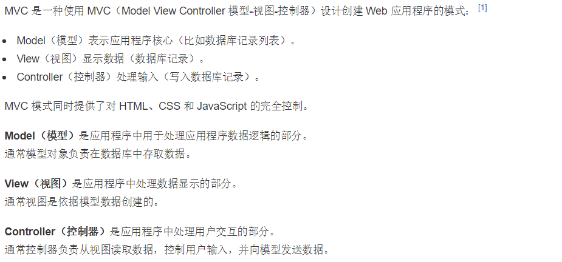
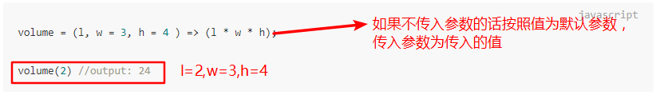
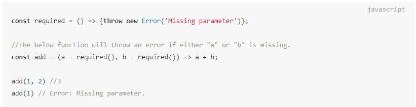
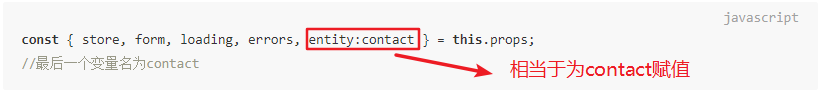
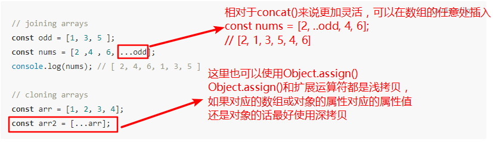
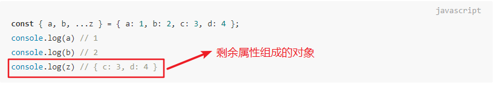
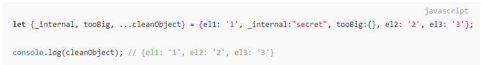

## shopapp

> 使用`vue-cli` 搭建的移动端项目  
> npm install  
> npm run dev  
> 访问：localhost:8080即可启动项目（需手动，并没有配置自动打开浏览器）

### 专业文件命名
* src,source  
  源代码，用`src`居多
* test,_tests_  
  测试文件，也经常用`_test_`  
* doc  
  文档 
* lib  
  库文件，library的缩写  
* dist  
  用来放打包编译后的文件，是distribution(分布，分配)的简写  
* build,scripts  
  构建脚本  
* utils,tools,helpers  
  工具代码  
* controllers,views,middlewares,models  
  MVC对应的models,views,controllers, 中间件middlewares  
    
* router  
  路由  
* server  
  用来放服务器代码  
* adapters  
  适配器，适配器模式是一种很常用的设计模式  
* legacy:遗赠，遗产  
  一般用来放兼容历史版本或兼容旧浏览器的代码  
* config  
  配置文件  
* assets,vendor  
  资源，一般用来放图片或css文件
* static  
  静态资源  
* examples,demo  
  示例  
* component  
  组件  
* plugins  
  插件  
* bin  
  命令脚本，命令行工具经常会用到  
* common  
  公用的文件  
* misc
  杂项，miscellaneous的缩写  
* core  
  核心文件  

### es6小技巧简单总结  
1. 函数传递默认参数值   
   当函数的参数为传入或者传入值为`undefined`时，会应用参数的默认值  
     
   默认值可以是表达式，所以我们可以将默认值**设置为一个执行函数**，如果该参数没有传值，就会执行我们的默认函数  
     
2. 解构赋值时分配变量名  
     
3. 扩展运算符简写  
   
   使用扩展运算符进行解构  
     
   使用扩展运算符移除对象的多余属性  
   
